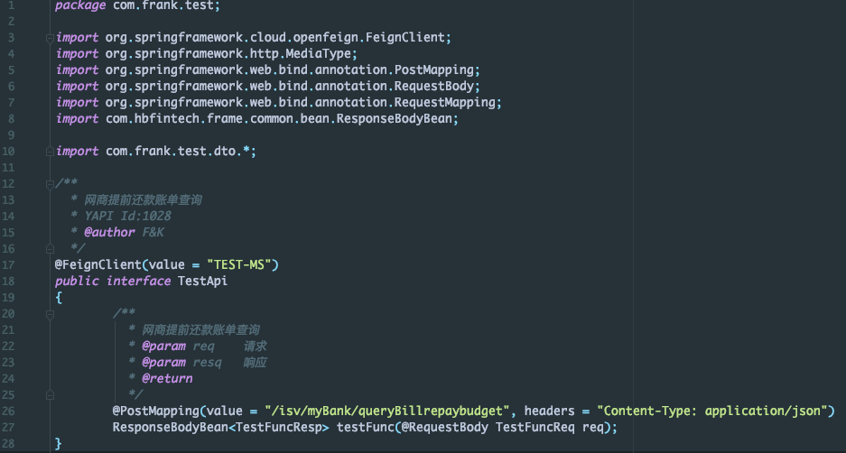
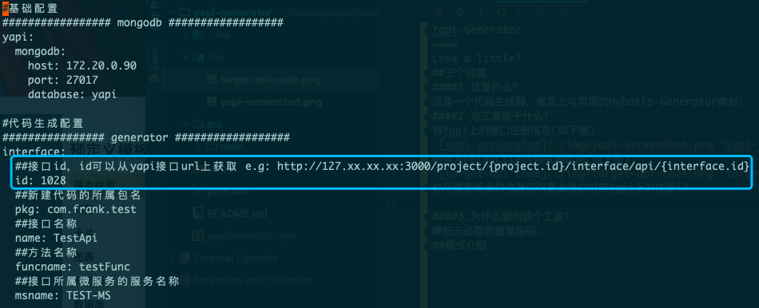
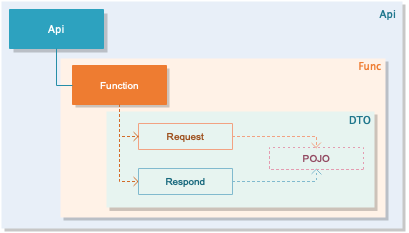
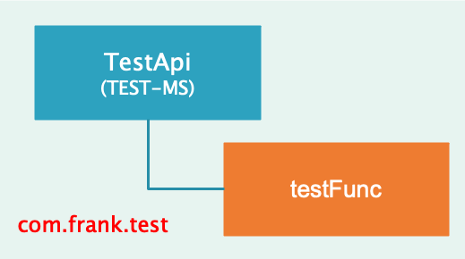

Yapi-Generator
====
微服务接口代码生成工具
## 简介
三个问题
#### 1.这是什么？
这是一个代码生成器，概念上与常用的Mybatis-Generator类似；
#### 2.这工具能干什么？
将Yapi上的接口注册信息(如下图)


转换为RestfulApi(FeignClient)形式的可运行代码(如下图)               
       


你所需要给出的配置信息仅仅是此接口对应Yapi上的注册id(如下图)



#### 3.为什么要用这个工具？
开发人员需要将有限的精力集中在业务，而不是重复代码的实现；
# 使用指导
### 快速开始
1.将yapi-generator.zip解压到一个文件夹

2.打开命令台运行以下命令
```
java -jar yapi-generator.jar
```
3.在当前文件夹获取生成好的代码
## 模式
Yapi-generator拥有直接生成可运行代码的能力，只需要极少的几个参数，就可以生成基于FeignClient的Restful接口，
并且可以生成request、respond中所依赖的Pojo(生成代码的基础结构如下图)；



Yapi-generator一共支持三种模式：单接口生成、批量接口生成与自动生成，这三种模式的区别很好理解分别是一次生成但接口
代码、多接口代码、以Project为维度自动生成完整的微服务API,目前在1.0中仅支持单接口生成模式。
#### 单接口生成模式
只要通过一下简单的几个配置项
```
#基础配置
################# mongodb ##################
yapi:
  mongodb:
    host: 127.0.0.1
    port: 27017
    database: yapi

#代码生成配置
################ generator ##################
interface:
  ##接口id，id可以从yapi接口url上获取 e.g: http://127.xx.xx.xx:3000/project/{project.id}/interface/api/{interface.id}
  id: 1031
  ##新建代码的所属包名
  pkg: com.frank.test
  ##接口名称
  name: TestApi
  ##方法名称
  funcname: testFunc
  ##接口所属微服务的服务名称
  msname: TEST-MS
```
你就可以将Yapi的注册信息生成为代码，生成代码结构如下图



#### 批量接口生成模式
还未发布

#### 自动生成模式
还未发布

